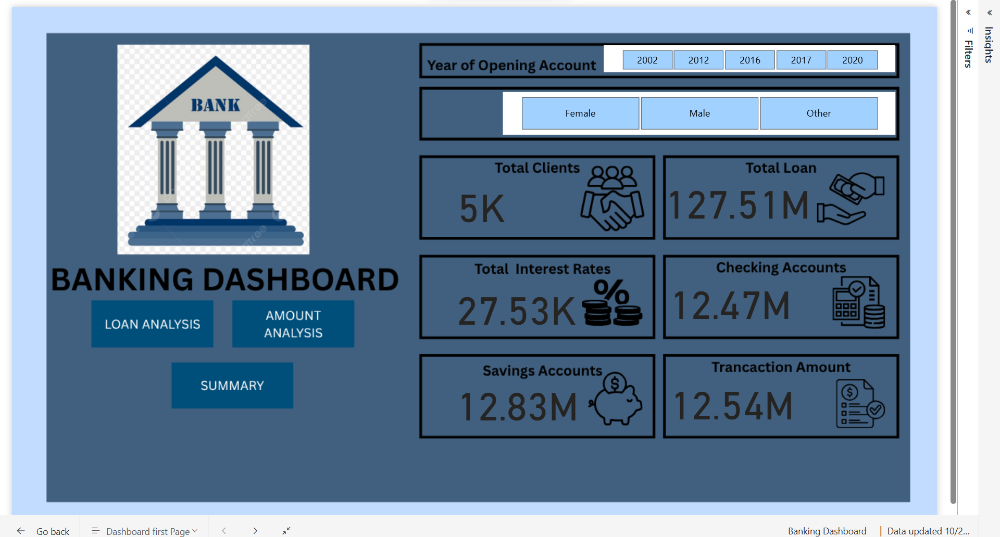

# 🏦 Comprehensive Banking Data Analysis & Power BI Dashboard

## Project Overview
This project focuses on performing **data cleaning, exploratory data analysis (EDA), and dashboard visualization** on a comprehensive banking dataset. The goal was to derive insights into customer profiles, transactions, loans, and credit behavior.

---

## Dataset Description
The dataset (sourced from Kaggle) contains detailed banking information including:
- **Customer Information:** ID, Name, Age, Gender, Address, Contact Details  
- **Account Information:** Account Type, Account Balance, Transaction History  
- **Loan Information:** Loan Amount, Type, Term, Interest Rate, Status  
- **Credit Card Details:** Credit Limit, Balance, Payment Due, Reward Points  
- **Feedback & Anomalies:** Feedback Date, Type, Resolution Status  

Total Records: **5,000+ customers**

---

## Data Pipeline
### 1. **Data Cleaning (Excel)**
- Removed duplicates  
- Formatted dates, text, and numeric values  
- Standardized categorical values (Gender, Account Type, etc.)

### 2. **Database Integration (SQL)**
- Imported the cleaned dataset into a **SQL relational database**
- Structured tables for Customers, Transactions, Loans, and Credit Cards
- Queried data for aggregation and insights

### 3. **Data Analysis (Python)**
- Connected SQL database to Python using `pandas` and `SQLAlchemy`
- Conducted **Exploratory Data Analysis (EDA)**:
  - Statistical summaries  
  - Correlation analysis  
  - Missing value detection  
- Generated **heatmaps and visual plots** for data relationships

### 4. **Dashboard Creation (Power BI)**
- Built an **interactive Power BI dashboard** to visualize:
  - Customer demographics  
  - Account summaries  
  - Loan and credit card performance  
  - Gender-based comparisons  
  - Yearly loan trends  

---

## Key Insights
### Overall Summary:
- **Total Clients:** 5,000  
- **Total Loan Amount:** \$127.51M  
- **Checking Accounts Total:** \$12.47M  
- **Savings Accounts Total:** \$12.83M  
- **Total Transaction Volume:** \$12.54M  
- **Total Loan Term:** 183K  
- **Total Reward Points:** 25M  
- **Total Credit Limit:** \$27.75M  
- **Total Credit Card Balance:** \$12.44M  

### Gender-Based Insights:
| Metric | Male | Female |
|--------|-------|---------|
| Total Clients | 1.63K | 1.73K |
| Total Loan | \$3.92M | \$4.32M |
| Checking Accounts | \$3.92M | \$4.36M |
| Savings Accounts | \$4.36M | \$4.24M |
| Transaction Volume | \$4.09M | \$4.24M |
| Loan Term | 60K | 63K |
| Reward Points | 8M | 9.59M |
| Credit Limit | \$9.09M | \$9M |
| Credit Card Balance | \$4.08M | \$4.29M |

### Loan Approval Insights:
- **Males Approved:** 551 (Total = \$1.44M)  
- **Females Approved:** 613 (Total = \$1.51M)  
- **Males Rejected:** 536 (Amount Not Provided = \$1.31M)  
- **Females Rejected:** 570 (Total = \$1.36M)  
- **Year with Most Loans:** 2020  

---

## Tools & Technologies
- **Excel:** Data Cleaning  
- **SQL (MySQL/PostgreSQL):** Database Management  
- **Python (pandas, seaborn, matplotlib):** EDA & Visualization  
- **Power BI:** Dashboard Creation  

---

## Dashboard Preview

## Conclusion
This project showcases how structured banking data can be transformed into **actionable insights** through effective data cleaning, analysis, and visualization. It highlights gender trends, financial product performance, and overall customer behavior patterns across the bank’s dataset.

---

